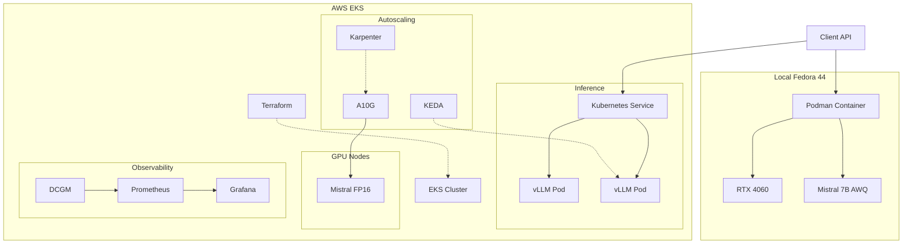
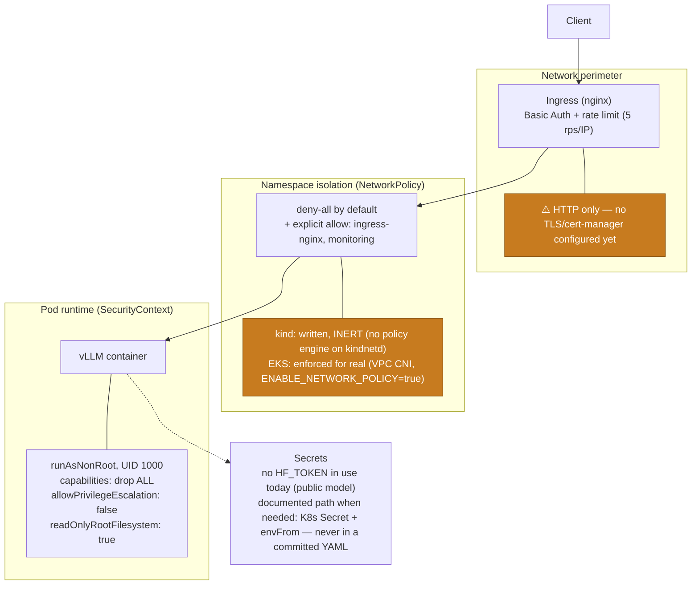
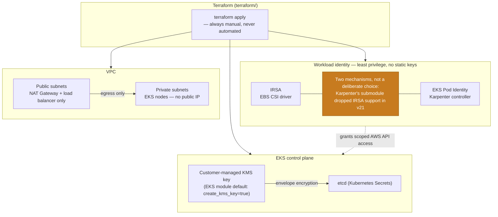

[](https://kubernetes.io/)
[](https://opensource.org/licenses/Apache-2.0)
[](https://golang.org/)
[](https://www.linkedin.com/in/julien-p-68834731/?locale=fr)

# Production-grade LLM serving platform on Kubernetes

vLLM model serving platform on Kubernetes — vLLM inference, GPU autoscaling with Karpenter and KEDA, with full observability (Prometheus, DCGM, Grafana) and costs tracking.

Built on Mistral open-weight models. 

Documented end-to-end by a senior infrastructure engineer learning AI infrastructure in public.

---

## Status

**Week 6/12 — in progress**

Local vLLM inference running on a single personal Nvidia graphic card (RTX 4060 with 8 GB VRAM) from a Docker container, with Mistral 7B Instruct v0.1 AWQ quantization. Baseline latency and throughput metrics captured.

Deployed on a local Kubernetes cluster (kind) with GPU passthrough: Deployment, Service, Ingress (SSE streaming validated end-to-end), PVC and KEDA autoscaling manifests applied.

Full observability stack live: Prometheus + DCGM Exporter (GPU metrics) + Grafana dashboard. KEDA's Prometheus trigger is now healthy end-to-end (`HPAActive=True`). Load benchmarking swept up to 128 concurrent requests with zero failures — vLLM's scheduler throttles admission under KV cache pressure (99.5% usage observed) instead of OOMing.

Security hardening done: `vllm-server` runs non-root (UID 1000), no capabilities, read-only root filesystem, no `privileged`. NetworkPolicies written and applied (inert on this cluster's CNI — no policy engine, documented). Ingress locked down with Basic Auth + rate limiting.

EKS migration: Terraform written for VPC + EKS + Karpenter-managed GPU node pool (see [`terraform/`](terraform/)) — validated (`init`/`validate`/`plan` up to the expected missing-credentials wall) but **not applied**. EKS-specific Kubernetes manifests also written (see [`kubernetes-eks/`](kubernetes-eks/) — no manual GPU passthrough needed there, unlike `kind`) but not yet deployed to a real cluster. No AWS credentials configured yet, and standing up real GPU nodes costs real money — that step is deliberately left for a deployer with an AWS account and budget sign-off, not run automatically.

---

## Architecture (target)

```
┌─────────────┐      ┌──────────────────────────────────────────┐
│   Client    │────▶│             Kubernetes (EKS)             │
└─────────────┘      │                                          │
                     │  ┌──────────┐      ┌─────────────────┐   │
                     │  │  Service │────▶│   vLLM Pods     │   │
                     │  └──────────┘      │  Mistral 7B     │   │
                     │                    │  (GPU nodes)    │   │
                     │  ┌──────────┐      └────────┬────────┘   │
                     │  │  KEDA    │               │            │
                     │  │ (scale   │◀─────────────┘            │
                     │  │  pods)   │                            │
                     │  └──────────┘                            │
                     │                                          │
                     │  ┌──────────┐      ┌─────────────────┐   │
                     │  │Karpenter │      │   Prometheus    │   │
                     │  │ (scale   │      │   DCGM Exporter │   │
                     │  │ nodes)   │      │   Grafana       │   │
                     │  └──────────┘      └─────────────────┘   │
                     └──────────────────────────────────────────┘
```

---
## Mermaid diagram


---

## Security architecture

Two views: what happens to a request on its way to vLLM (perimeter → namespace → pod), and how the AWS/EKS side protects identity and data at rest. Both reflect what's actually built (weeks 5-6), including the honest gaps — nothing here is aspirational.

### Request path (perimeter → pod)



### AWS / EKS infrastructure



## Stack

| Layer | Technology |
|---|---|
| Model | Mistral 7B Instruct v0.1 AWQ (Apache 2.0) |
| Inference server | vLLM 0.20.2 |
| Container runtime | Podman (Fedora 44) |
| Orchestration | Kubernetes — kind (local) → EKS (cloud) |
| Node autoscaling | Karpenter |
| Pod autoscaling | KEDA (queue depth metric) |
| GPU observability | DCGM Exporter + Prometheus + Grafana |
| Infrastructure as code | Terraform |
| Hardware (local) | NVIDIA RTX 4060 8 GB VRAM |
| Hardware (cloud) | NVIDIA A10G 24 GB VRAM (g5.xlarge) |

---

## Roadmap

- [x] **Week 1** — local vLLM inference working (Mistral 7B AWQ on RTX 4060, baseline metrics captured)
- [x] **Week 2** — clean Containerfile, all OpenAI-compatible endpoints tested
- [x] **Week 3** — Kubernetes deployment on kind (local), GPU passthrough, Ingress + SSE streaming validated, KEDA autoscaler wired (Prometheus trigger pending Week 4)
- [x] **Week 4** — Prometheus/DCGM/Grafana observability, load benchmarking (128 concurrent requests, 0 failures), GPU resource management (nodeAffinity/tolerations)
- [x] **Week 5** — security hardening: NetworkPolicies (written, inert on kindnet — no policy engine), non-root/read-only SecurityContext, secrets review (none needed — public model), graceful shutdown, Ingress Basic Auth + rate limiting
- [ ] **Week 6** — migration to EKS with GPU nodes (g5.xlarge), Karpenter node autoscaling. Terraform (`terraform/`) and EKS-specific Kubernetes manifests (`kubernetes-eks/`) written and validated; not yet applied/deployed (no AWS credentials, real cost — deliberately left for manual apply)
- [ ] **Week 7-8** — KEDA pod autoscaling on queue depth, load testing with latency benchmarks
- [ ] **Week 9-10** — full observability stack (Prometheus, DCGM, Grafana dashboard: TTFT, GPU util, throughput, cost per 1M tokens)
- [ ] **Week 11-12** — architecture diagrams, clean README, lessons-learned article

---
## Observability targets

The goal is a Grafana dashboard tracking four key metrics in production:

- **TTFT** (time to first token) — P50 and P95
- **Throughput** — tokens per second per GPU
- **GPU utilization** — via DCGM Exporter
- **Cost efficiency** — estimated cost per 1M tokens based on cloud instance pricing

---

## Why Mistral

This project deliberately uses Mistral open-weight models rather than Meta's Llama or Alibaba's Qwen. 

Mistral AI is a Paris-based lab building sovereign European AI infrastructure — using and documenting their models in production is a concrete way to support that ecosystem. All models used in this project are released under the Apache 2.0 license.

This sovereignty-conscious approach aligns well with European corporates and financial institutions building their AI platforms.

---

## Week 1 — lessons learned

Getting vLLM running on a consumer GPU involved several non-obvious constraints worth documenting.

### **Model format matters more than model size.** 
Mistral 7B in FP16 requires ~14 GB VRAM — impossible on a 8 GB card. The AWQ 4-bit quantized version fits in ~4 GB and delivers usable throughput. Understanding the difference between FP16, BF16, FP8, and AWQ quantization is a prerequisite for any AI infrastructure work.


### **Fedora Silverblue requires a different mental model.** 
The **immutable OS** means no direct simple package install — everything goes through `rpm-ostree` with a mandatory reboot for OS changes, but most changes cannot happen. We need to create virtual environments with `toolbox`. As handy as it can be, it also come with additional management challenges !

The NVIDIA Container Toolkit SSL configuration needed manual adjustment because rpm-ostree runs in an isolated context that cannot access the system CA bundle at the expected path. 

Toolbox containers do not have GPU access by default — vLLM runs in a dedicated Podman container launched from the host, not from inside toolbox.

Because Fedora Silverblue is immutable, NVIDIA drivers are installed through rpm-ostree layering :
```
rpm-ostree install akmod-nvidia xorg-x11-drv-nvidia-cuda
nvidia-smi
```

It can surprise, but even after installation and reboot, it's still not available, as akmods requires some minutes to compile fully.

### **Secure Boot and NVIDIA drivers**

The Secure Boot option may need to be disabled in the BIOS when using proprietary NVIDIA drivers on Linux.

The NVIDIA kernel modules installed through RPM Fusion are not always signed with a key trusted by Secure Boot. If Secure Boot is enabled, the modules may fail to load, resulting in missing GPU acceleration.

Alternative approaches exist, such as manually enrolling a Machine Owner Key (MOK) and signing the NVIDIA modules, but disabling Secure Boot remains the simplest option for many workstation setups and temporary personal test labs.

### **Baseline metrics (Mistral 7B AWQ, RTX 4060):** 
See docs/week-01-baseline.md for the full benchmark results — captured against the original v0.2-AWQ setup (context 2048 tokens), before the switch to v0.1-AWQ (context 880 tokens) described above.

---
## Week 2 — lessons learned

### Immutable OS is too rigid for labs
After testing exensively Fedora Silverblue 43, I eventually chose to switch to the normal Fedora Workstation experience. Indeed, the immutable OS seemed great and stable at first sight, but its rigidity added a significant number of slowness and difficulties to labs. Also, I found that it would be less applicable and usable for people who would be interested to use and test my repository, as most people don't go that far in testing Linux distributions.
The concept is strong, though, I will come back to it in some years!

### Kind is the best local Kubernetes orchestrator for AI
- **k3s** is great, light and conveninent, but less adapted for GPU labs ;
- **minikube** was not available by default on my Fedora 44 and anyway it's a bit more complex.

=> **kind** is handy and it's the best of those three to handle GPU-based pods.
---

## Week 3 — lessons learned

Getting the GPU into `kind` itself, then keeping the cluster alive across restarts, turned out to be the real work of this week — Kubernetes deployment mechanics came second.

### `kind` doesn't relay GPU passthrough automatically, even when the host already has it working
Podman already exposes the RTX 4060 to plain containers via CDI, and I assumed the same would carry through to `kind`'s node containers. It doesn't — `kind` runs its "nodes" as regular containers with no awareness of the host's CDI setup. I had to mount the GPU device nodes and the driver's userspace libraries (`libcuda.so`, `libnvidia-ml.so`) into the node container by hand, then repeat the *same* manual mounts on the NVIDIA device plugin, and then *again* on every application pod that needs the GPU — the device plugin's default "envvar" strategy assumes a `nvidia-container-runtime` that simply isn't there to act on it.

### Loading a local image into `kind` under podman isn't a one-liner
`kind load docker-image` fails silently with the podman provider ("image not present locally", even though `podman images` lists it fine). The workaround is `podman save` to a tarball followed by `kind load image-archive` — and recreating the cluster means redoing this, since a fresh node has never seen the image.

### All pods on a `kind` node share one Linux `pids` cgroup
This one looked like random flakiness at first: `ingress-nginx` and the KEDA operator kept crashlooping with `pthread_create() failed (Resource temporarily unavailable)`. The actual cause was a shared, cluster-wide pid budget (2048) on the single node container — vLLM's CUDA runtime plus every system pod together were exhausting it. Not a Kubernetes problem at all; fixed with `podman update --pids-limit`.

### Host-level limits bite even when the problem "feels like" Kubernetes
`fs.inotify.max_user_instances`, shared with the desktop GNOME session, was the real blocker behind a KEDA install failure. A reminder that a local lab node isn't isolated from the workstation it runs on.

---

## Week 4 — lessons learned

Observability was mostly smooth engineering — the surprises were in the places where naming, defaults, and privilege quietly didn't do what I expected.

### A Service name that doesn't match the Deployment name breaks scraping silently
`vllm-server` is the Deployment and its pods; the actual Service is `vllm-service`. Prometheus failed to resolve the wrong name with no other symptom — worth double-checking `kubectl get svc` before writing a scrape config from memory.

### `RollingUpdate` doesn't mix with anything that has exactly one owner
Twice this project hit the same failure shape from two different causes: Prometheus's `RollingUpdate` tried to start a new pod before killing the old one, and both fought over the same TSDB lockfile on a `ReadWriteOnce` volume. Weeks later, the same thing happened to vLLM itself over the single GPU on the node. `strategy: Recreate` is the fix whenever a workload owns something that can't be shared, even briefly.

### `privileged: true` isn't free, even when it "should" just work
DCGM Exporter's container failed to even start under `privileged: true` — not because of anything GPU-related, but because privileged mode makes runc try to mirror *every* device node on the host, including one (`/dev/cpu/1/cpuid`) that happened to be broken on this particular `kind` node. Dropping to a single specific capability (`SYS_ADMIN`) instead of blanket privilege fixed it — and turned out to be better practice anyway.

### The most useful finding of the week wasn't a bug
Pushed vLLM to 128 concurrent requests expecting to find the KV-cache OOM limit. It never crashed. The scheduler throttled how many requests it actually admitted (down from 128 to 15 concurrent) and queued the rest, trading latency for stability. That's continuous batching doing exactly its job — worth knowing before assuming "more load = crash."

---

## Week 5 — lessons learned

Security hardening is where things stopped being "does it run" and became "does it actually do what the YAML claims."

### Writing a NetworkPolicy isn't the same as enforcing one
`kind`'s default CNI (`kindnetd`) accepts and stores `NetworkPolicy` objects via the API server without enforcing a single one of them — no error, no warning. I only caught this by deliberately testing: a pod outside every `allow` rule could still reach a supposedly locked-down service. The manifests stayed (they're correct, and will actually work on EKS's VPC CNI), but I wouldn't have trusted them without that test.

### Running as non-root exposes assumptions baked into the base image
Two separate failures, both from the same root cause: a UID (1000) with no corresponding entry in the image's `/etc/passwd`. First, a Python library (`torch`) crashed trying to resolve the current username — fixed by setting `USER`/`HOME` env vars, which Python checks before falling back to a passwd lookup. Second, and more subtly, `/root` itself turned out to be mode `700` in the base image — a non-root user can't even *traverse* into it, regardless of what's mounted underneath. `fsGroup` fixes ownership of a volume's contents; it does nothing for a parent directory inherited from the image. Had to relocate the cache path out of `/root` entirely.

### A real secret briefly ended up in this very conversation
While setting up Ingress Basic Auth, I echoed a freshly generated password to the terminal and then reused it in a follow-up command. Claude Code's own safety layer flagged and blocked the second use as credential re-exposure — correctly. I treated the leaked password as compromised, rotated it immediately, and re-ran the test without ever printing the real value again. Worth including here precisely because it's the kind of near-miss that's easy to leave out of a "lessons learned" section.

---

## Week 6 — lessons learned

This week's lesson wasn't about Kubernetes or AWS at all — it was about the shelf life of AI-generated infrastructure code.

### AI-authored Terraform goes stale the moment it's written
I asked Claude Code to write the EKS + Karpenter Terraform, and it pinned every provider and module version from its training data. A simple question — "why is the Helm provider resolving to 2.17.0 when Helm is well past 3.20 by now?" — turned out to conflate two things (a Terraform *provider's* version number has never tracked the wrapped tool's own version), but it also surfaced a real problem underneath: every single pinned dependency had a major version bump by the actual current date, roughly eight months past the assistant's training cutoff — `hashicorp/aws` 5→6, `hashicorp/kubernetes` 2→3, `hashicorp/helm` 2→3, the `terraform-aws-modules` EKS/VPC/IAM modules all majored up, and the Karpenter chart itself jumped from 1.0.6 to 1.14.1. None of this shows up as an error until you actually try to `init` against the real registry.

### Major version bumps in "stable" modules can be one-way traps
Re-verifying against the actually-downloaded module source (not memory) caught two nasty ones: the EKS module dropped the `cluster_` prefix from its input variables but kept it on every output — an easy asymmetric mistake to miss — and Karpenter's own IAM submodule removed IRSA support entirely in favor of Pod Identity, which isn't a renamed field, it's a different security mechanism requiring a different EKS addon.

### Even AI review needs a second AI review
Before committing the EKS-specific Kubernetes manifests, I caught (or rather, Claude caught itself) that its first draft of the DCGM Exporter manifest requested `nvidia.com/gpu` as a resource — which would have made the monitoring DaemonSet compete with vLLM for the single GPU on a `g5.xlarge` node. The fix (an env-var-based device injection strategy instead of a resource claim) was already the pattern used on `kind`; the bug only existed because the new EKS version wasn't written by directly extending working code, it was reasoned from scratch. A reminder to diff against what's already proven to work, not just what looks idiomatic for the new environment.

---

## Author

Senior Infrastructure Engineer (AWS, Kubernetes, Terraform, GPU observability) transitioning into AI infrastructure (as of April 2026).

Documenting the full journey publicly — including dead ends, wrong turns, and real production constraints.

[LinkedIn](https://www.linkedin.com/in/julien-p-68834731/) · [GitHub](https://github.com/PhenixForge)