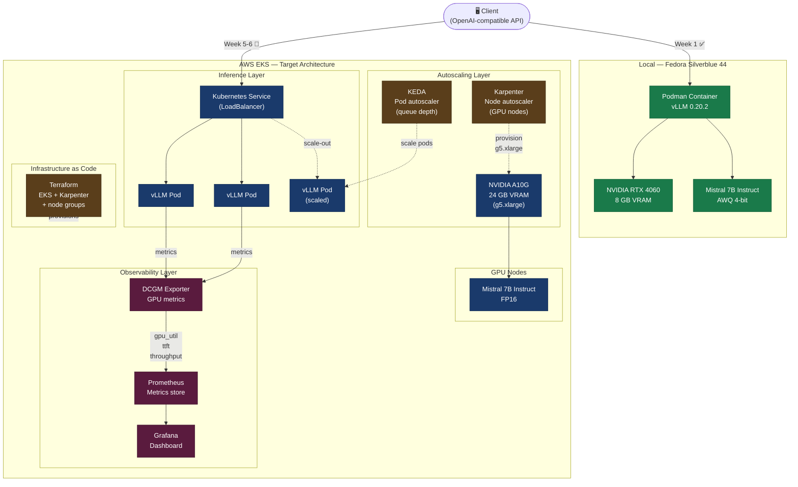

````markdown
# vllm-serving-kubernetes-platform

Production-grade LLM serving platform on Kubernetes — vLLM inference, GPU autoscaling with Karpenter and KEDA, full observability (Prometheus, DCGM, Grafana). Built on Mistral open-weight models. Documented end-to-end by a senior infrastructure engineer learning AI infrastructure in public.

---

## Status

**Week 1/12 — complete**

Local vLLM inference running on a single RTX 4060 (8 GB VRAM) with Mistral 7B Instruct v0.2 AWQ quantization. Baseline latency and throughput metrics captured.

---

## Architecture (target)

```
┌─────────────┐     ┌──────────────────────────────────────────┐
│   Client    │────▶│              Kubernetes (EKS)           │
└─────────────┘     │                                          │
                    │  ┌──────────┐      ┌─────────────────┐   │
                    │  │  Service │────▶│   vLLM Pods     │   │
                    │  └──────────┘      │  Mistral 7B     │   │
                    │                    │  (GPU nodes)    │   │
                    │  ┌──────────┐      └────────┬────────┘   │
                    │  │  KEDA    │               │            │
                    │  │ (scale   │◀─────────────┘            │
                    │  │  pods)   │                            │
                    │  └──────────┘                            │
                    │                                          │
                    │  ┌──────────┐      ┌─────────────────┐   │
                    │  │Karpenter │      │   Prometheus    │   │
                    │  │(scale    │      │   DCGM Exporter │   │
                    │  │ nodes)   │      │   Grafana       │   │
                    │  └──────────┘      └─────────────────┘   │
                    └──────────────────────────────────────────┘
```

---
## Mermaid diagram



---

## Stack

| Layer | Technology |
|---|---|
| Model | Mistral 7B Instruct v0.2 (Apache 2.0) |
| Inference server | vLLM 0.20.2 |
| Container runtime | Podman (Fedora Silverblue 44) |
| Orchestration | Kubernetes — kind (local) → EKS (cloud) |
| Node autoscaling | Karpenter |
| Pod autoscaling | KEDA (queue depth metric) |
| GPU observability | DCGM Exporter + Prometheus + Grafana |
| Infrastructure as code | Terraform |
| Hardware (local) | NVIDIA RTX 4060 8 GB VRAM |
| Hardware (cloud) | NVIDIA A10G 24 GB VRAM (g5.xlarge) |

---

## Roadmap

- [x] **Week 1** — local vLLM inference working (Mistral 7B AWQ on RTX 4060, baseline metrics captured)
- [ ] **Week 2** — clean Containerfile, all OpenAI-compatible endpoints tested
- [ ] **Week 3-4** — Kubernetes deployment on kind (local), Deployment + Service + ConfigMap manifests
- [ ] **Week 5-6** — migration to EKS with GPU nodes (g5.xlarge), Karpenter node autoscaling
- [ ] **Week 7-8** — KEDA pod autoscaling on queue depth, load testing with latency benchmarks
- [ ] **Week 9-10** — full observability stack (Prometheus, DCGM, Grafana dashboard: TTFT, GPU util, throughput, cost per 1M tokens)
- [ ] **Week 11-12** — architecture diagrams, clean README, lessons-learned article

---

## Week 1 — lessons learned

Getting vLLM running on a consumer GPU involved several non-obvious constraints worth documenting.

**Model format matters more than model size.** Mistral 7B in FP16 requires ~14 GB VRAM — impossible on a 8 GB card. The AWQ 4-bit quantized version fits in ~4 GB and delivers usable throughput. Understanding the difference between FP16, BF16, FP8, and AWQ quantization is a prerequisite for any AI infrastructure work.

**Fedora Silverblue requires a different mental model.** The immutable OS means no `dnf install` — everything goes through `rpm-ostree` with a mandatory reboot. The NVIDIA Container Toolkit SSL configuration needed manual adjustment because rpm-ostree runs in an isolated context that cannot access the system CA bundle at the expected path. Toolbox containers do not have GPU access by default — vLLM runs in a dedicated Podman container launched from the host, not from inside toolbox.

**Baseline metrics (Mistral 7B AWQ, RTX 4060, context 2048 tokens):** to be updated after benchmark run.

---

## Observability targets

The goal is a Grafana dashboard tracking four key metrics in production:

- **TTFT** (time to first token) — P50 and P95
- **Throughput** — tokens per second per GPU
- **GPU utilization** — via DCGM Exporter
- **Cost efficiency** — estimated cost per 1M tokens based on cloud instance pricing

---

## Why Mistral

This project deliberately uses Mistral open-weight models rather than Meta's Llama or Alibaba's Qwen. Mistral AI is a Paris-based lab building sovereign European AI infrastructure — using and documenting their models in production is a concrete way to support that ecosystem. All models used in this project are released under the Apache 2.0 license.

---

## Author

Senior Infrastructure Engineer (AWS, Kubernetes, Terraform, GPU observability) transitioning into AI infrastructure.
Documenting the full journey publicly — including dead ends, wrong turns, and real production constraints.

[LinkedIn](https://www.linkedin.com/in/julien-p-68834731/) · [GitHub](https://github.com/PhenixForge)
````